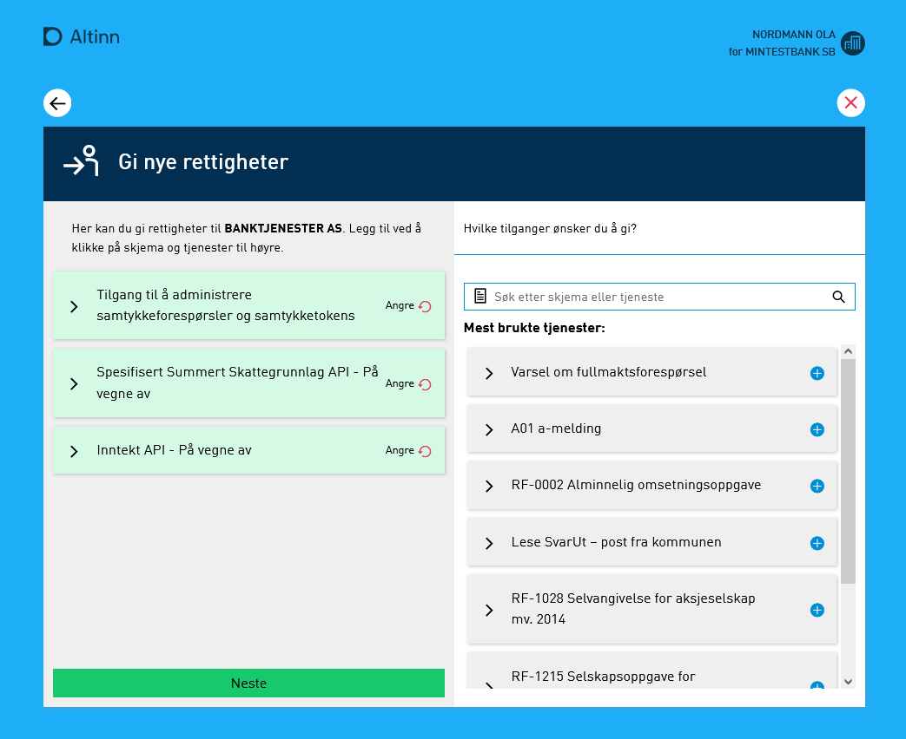

## Overordnet om leverandørstøtte

Leverandører kan opprette samtykkeforespørsler, hente ut samtykketoken og logge oppslag på vegne av sine konsumenter. Det er to ulike måter dette kan løses på, hvorav den første er anbefalt for nye integrasjoner.

I begge tilfeller benyttes begrepet *HandledBy* om leverandører, til forskjell fra *CoveredBy* som er datakonsumenten og den juridiske mottakeren av samtykket. *OfferedBy* er parten som har gitt et samtykke. Leverandøren må ha sin egen API-nøkkel knyttet til eget organisasjonsnummer. 

## Bruk av leverandørtoken i Maskinporten (anbefalt)

{}
Se <a href="../../../../api/rest/kom-i-gang/virksomhet/">virksomhetsautentisering</a> om generell informasjon om hvordan en setter opp autentisering av en virksomhet mot Altinn API
{}

Kall til endepunktene for å opprette samtykkeforespørsler og uthenting av samtykketoken kan autentiseres gjennom [API-delegering i Maskinporten](../../../api-delegering), og beskyttes med [scopene](../../../../api/rest/kom-i-gang/scopes/#sluttbruker-api) 
* `altinn:consentrequests.read`
* `altinn:consentrequests.write`
* `altinn:consenttokens` 

Disse tre scopene er gjort delegerbare i Altinn under navnet "**Tilgang til å administrere samtykkeforespørsler og samtykketokens**". 

### 1. Datakonsument gir leverandør tilgang 

For at leverandøren skal få tilgang til å opprette samtykkeforespørsler og hente ut samtykketokens på vegne av datakonsumenten, må en hovedadministrator delegere tilgang til **Tilgang til å administrere samtykkeforespørsler og samtykketokens** til leverandørens organisasjonsnummer.



### 2. Leverandøren henter ut leverandørtoken fra Maskinporten

Leverandøren forespør Maskinporten om access_token på vegne av datakonsumenten for `altinn:consentrequests.write`. Dette er tilstrekkelig for å opprette samtykkeforespørsler. Denne prosessen er beskrevet nærmere i [guiden for brukere av API-delegering](../../../api-delegering/api-bruker).

Dette tokenet en en JWT som inneholder en ekstra påstand ("claim") sammenlignet med ordinære Maskinporten-token, nemlig `supplier`. I dette claimet står leverandørens organisasjonsnummer, mens `consumer`-claimet inneholder datakonsumentens nummer. Dette vil si at `supplier` er det samme som `HandledBy` mens `consumer` er det samme som `CoveredBy`.

### 3. Leverandøren oppretter en samtykkeforespørsel på vegne av datakonsument

Ved hjelp av access-tokenet mottatt i forrige trinn, samt en API-nøkkel mottatt fra Altinn (tilknyttet leverandørens organisasjonsnummer) kan forespørselen opprettes. Merk at dette er identisk til en vanlig forespørsel, men feltet `HandledBy` må i tillegg oppgis, som da er leverandørens eget organisasjonsnummer.

{}
Merk altså at til forskjell for den gamle lenkebaserte samtykkeløsningen trenger ikke leverandøren ha API-nøkler for hver enkelt av de datakonsumenter den representerer - leverandøren skal alltid oppgi sin egen API-nøkkel.
{}

```
{
    "CoveredBy": "910514458",               --Orgnr til datakonsument
    "HandledBy": "912345678",               --Orgnr til leverandør
    "OfferedBy": "27042000537",             --Fnr/orgnr til den som gir samtykke
    "OfferedByName": "NORDMANN",            --Etternavn/orgnavn til samme
    "ValidTo": "2019-09-30T10:30:00.000",   --Gyldighetsdato for samtykke 
    "RedirectUrl": "https://www.altinn.no", --URL som bruker sendes til
    "PortalViewMode": "Hide",               --Om den skal synes i portalen¹
    "RequestResources": [                   --Tjenestene med eventuelle metadata
        {
            "ServiceCode": "4629",
            "ServiceEditionCode": 2,
            "Metadata": {
                "inntektsaar": "2016"
            }
        },
        {
            "ServiceCode": "4630",
            "ServiceEditionCode": 2,
            "Metadata": {
                "fraOgMed": "2017-06",
                "tilOgMed": "2017-08"
            }
        }
    ],
    "RequestMessage": {     --Tidligere omtalt som DelegationContext
        "no-nb": "Ved å samtykke, gir du Skatteetaten rett til å utlevere...",
        "no-nn": "Ved å samtykka, gir du Skatteetaten rett til å utlevera...",
        "en": "By accepting the consent, you grant the Tax Authority the..."
    }
}
```
{}
¹ `PortalViewMode` bestemmer om en samtykkeforespørsel skal være synlig i portalen for sluttbruker eller ikke. Forespørsler som besvares via portal vil ikke medføre at sluttbrukeren blir sendt til endepunkt oppgitt i `RedirectUrl`.
{}

### 4. Uthenting av token

Etter at samtykke er innhentent (enten via redirect av bruker) eller at bruker har besvart samtykket via Altinn-portalen, kan token uthentes. På samme måte som ved opprettelse av samtykkeforespørselen må det uthentes leverandørtoken, denne gangen med scopet `altinn:consenttokens.read`, for å kunne hente ut samtykketoken for en gitt authCode.

For øvrig er løpet det samme uansett om leverandør benyttes eller ikke. Ved bruk av tjenesteeierstyrt rettighetsregister vil ikke leverandøren trenge å hvitelistes av tjenesteeier, og datakonsumenten står fritt til å bytte mellom leverandører.

 Merk at leverandører kun har mulighet til å se samtykkeforespørsler de selv har opprettet på vegne av en datakonsument, og ikke eventuelt andre leverandøres forespørsler for samme datakonsument. 

## Bruk av virksomhetssertifikat 

Som et alternativ til Maskinporten kan leverandørens eget virksomhetssertifikat benyttes for å opprette samtykkeforespørsler på vegne av andre. Datamodellen som sendes inn er identisk som ved bruk av Maskinporten-token. 

Relasjonen mellom `CoveredBy` og `HandledBy` blir her autorisert i [tjenesteeierstyrt rettighetsregister](). Ved bruk av leverandører med kun virksomhetssertifikat er derfor bruk av tjenesteeierstyrt rettighetsregister påkrevd for alle ressursene som omfattes av samtykkeforespørselen. Tjenesteeier må i tillegg til å oppgi hvem som kan være datakonsumenter oppgi hvem som kan være leverandør for en gitt datakonsument (kun 1).

**Siden dette mønsteret flytter byrden knyttet til håndtering av leverandører over på tjenesteeieren i stedet for datakonsumenten, anbefaler vi ikke dette mønsteret ved bruk av leverandører hvis Maskinporten kan benyttes.**
